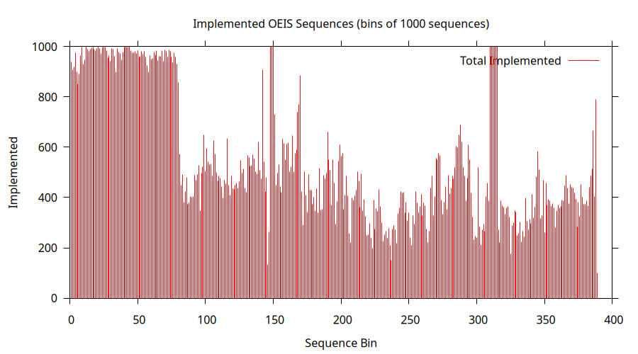
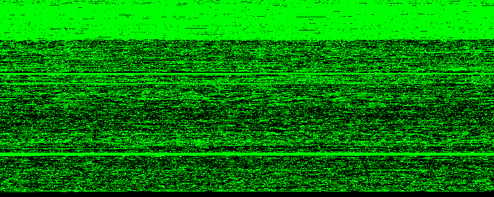

jOEIS
=====

A collection of Java programs implementing sequences from [The On-Line
Encyclopedia of Integer Sequences](https://oeis.org/) (OEIS).

This is likely the largest coherent collection of programs for OEIS
sequences beyond the Maple, Mathematica, and Pari programs directly
associated with many entries.  Currently over 77000 sequences are
implemented. The following plot shows the number of sequences
implemented (in bins of 1000):



A similar plot with one pixel for each sequence. Green indicates an
implemented sequence, red a dead sequence (where an implementation is
not needed). Black indicates to be done, feel free to help.



Implementations of specific sequences implement the ```Sequence```
interface which provides a single method ```next()```.  The contract
requires this to produce either the next member of the sequence or
```null``` in the case of reaching the end of a finite sequence.  In
addition, it might sometimes throw an
``UnsupportedOperationException`` if the computing the next value is
beyond the current implementation or if it would exceed the values
that can be represented by the big integer class.

There is no direct support for generating the nth term of a sequence
and so to generate the nth term, it is necessary to call ```next()```
repeatedly until the desired term is reached.  Internally this
sometimes leads to significant inefficiency (e.g. generating functions
being repeatedly expanded to higher and higher degree), but keeps the
overall contract as simple as possible.

Implementations are not necessarily the best known algorithm for
particular sequences.  For many important sequences you are not going
to be able to compute new terms using the implementations provided.
However, included here are implementations that have been used to
compute new previously unknown terms, including some for sequences
considered ```hard```.


Related Software
----------------

Because Java does not come with libraries supporting all the things we
need to do to construct integer sequences, a lot of functionality has
been built from the ground up.  While a lot of this is implemented
specifically for this project, there are important pieces of code
which have been re-implemented or ported from other projects.

Although Java has its own BigInteger class for large integers, this
project uses a big integer type, ```Z.java``` based originally on the
Lenstra's lip C package.

Most sequences requiring real number arithmetic are handled using
classes based on Hans-J. Boehm's [constructible real
arithmetic](http://www.hboehm.info/crcalc/CRCalc.html).  A smaller
number of real number based sequences make use of Mikko Tommila's
[apfloat library](http://www.apfloat.org/apfloat_java/).

Certain parts of the nauty package for computing automorphism groups
of graphs and digraphs were ported to Java.  Included here by
permission (see associated copyright).  For serious work needing this
functionality, I would recommend using the C implementations available
from [nauty](http://users.cecs.anu.edu.au/~bdm/nauty/).

Similarly, parts of the plantri package for generating planar graphs
were ported to Java. Included here by permission (see associated
copyright).  Again canonical implementation is available from
[plantri](https://users.cecs.anu.edu.au/~bdm/plantri/).

Certain sequences requiring factorization of large integers are backed
by queries to [factordb.com](http://factordb.com).

Certain sequences involving counting positions in chess make use of
the [Chesspresso library](http://www.chesspresso.org/) by Bernhard
Seybold.

Testing
-------

The individual sequence implementations are tested again the data
lines of the corresponding OEIS entries. In order to run the tests,
the ```stripped.gz``` must first be retrieved from the OEIS server and
layed out in a way the tests expect.  This is accomplished by
```test/irvine/oeis/Makefile```.  In addition to tests for individual
sequences, the test suite also covers functionality of shared library
code.

Other Acknowledgements
----------------------

This project has benefited immensely and on numerous occasions by
other contributors to the OEIS and members of the seqfan mailing list.
This ranges from explanations of sequences, detective work, finding
papers for me, vetting edits resulting from this project.

References
----------

* H-J. Boehm, The constructive reals as a Java library, ''The Journal
  of Logic and Algebraic Programming'', **64**, (2005),
  3-11. [https://doi.org/10.1016/j.jlap.2004.07.002]

* G. Brinkmann and B. D. McKay, Fast generation of planar graphs
  (expanded
  edition). [https://users.cecs.anu.edu.au/~bdm/papers/plantri-full.pdf]

* G. Brinkmann, S. Greenberg, C. Greenhill, B. D. McKay, R. Thomas and
  P. Wollan, Generation of simple quadrangulations of the sphere,
  ''Discrete Mathematics'', **305** (2005)
  33-54. [https://users.cecs.anu.edu.au/~bdm/plantri/quad.pdf]

* A. K. Lenstra, lip: long integer package. Bellcore,
  1989. [http://read.pudn.com/downloads103/doc/comm/422470/freelip_1.1/lipdoc.pdf]

* B. D. McKay and A. Piperno, Practical Graph Isomorphism, II,
  ''J. Symbolic Computation'', (2013) **60**
  94-112. [http://dx.doi.org/10.1016/j.jsc.2013.09.003]

